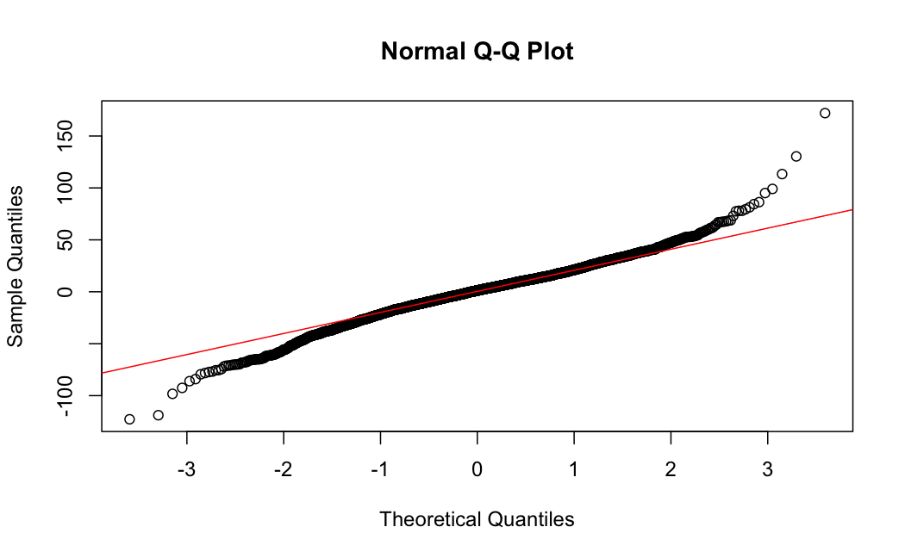

# Modeling U.S. County-level Cancer Mortality Rates
Scottie Szewczyk
2025-09-19

------------------------------------------------------------------------

# Introduction

**In this study, we will create an ordinary least-squares (OLS) linear
regression model for U.S. county-level cancer mortality rates based on
county-level socioeconomic parameters.**

To conduct our analysis, we will perform EDA on our selected predictors,
fit an initial model, and then use variable selection methods to pare
down our model. We will also evaluate OLS assumptions and check for
influential points and outliers. Finally, we will give some example
predictions and examine predictor importances before presenting our
final model summary.

## Data

We will use the `cancer_reg` dataset provided by Rippner (2016) on
`data.world`. The dataset includes socioeconomic information, health
insurance coverage data, and cancer-related statistics on over 3,000
U.S. counties. The variables were created from 2013 Census estimates and
aggregations from the years 2010-2016.

According to Rippner, “These data were aggregated from a number of
sources including the American Community Survey
([census.gov](http://census.gov/)),
[clinicaltrials.gov](http://clinicaltrials.gov/), and
[cancer.gov](http://cancer.gov/).” The dataset is licensed under the
public domain. Detailed information on the data preparation can be found
on the *Cancer Trials* page of `data.world`.

# SECTION I: EDA

We will begin by conducting an exploratory data analysis (EDA) on the
variables under consideration for the model.

``` r
library(lmtest)
library(MASS)
library(rms)
library(scales)
library(tidyverse)
data_raw <- read_csv('../data/cancer_reg.csv')
```

## Variables

The following variable descriptions are from the data dictionary
provided by Rippner (2016).

### Response Variable

Our response variable is `TARGET_deathRate`, which is the mean number of
per capita (per 100,000 residents) cancer mortalities.

### Predictor Variables

We will start with a selection of socioeconomic predictors for our
model:

- `MedianAge`: Median age of county residents

- `medIncome`: Median income per county

- `PctEmployed16_Over`: Percent of county residents ages 16 and over
  employed

- `PctPrivateCoverage`: Percent of county residents with private health
  coverage

- `PctPublicCoverage`: Percent of county residents with
  government-provided health coverage

- `PctUnemployed16_Over`: Percent of county residents ages 16 and over
  unemployed

- `popEst2015`: Population of county

- `povertyPercent`: Percent of populace in poverty

``` r
# Reduce our data set down to only the necessary variables.
# NOTE: When the MASS package is loaded, the select() funciton
# needs to be explicitly called from dplyr.
data_reduced <- data_raw %>% 
                  dplyr::select(TARGET_deathRate, MedianAge, medIncome,
                                PctEmployed16_Over, PctPrivateCoverage, PctPublicCoverage,
                                PctUnemployed16_Over, popEst2015, povertyPercent)
```

## Missing Values / Errors

To begin, we will search for any missing values or errors in the data
set.

``` r
summary(data_reduced)
```

     TARGET_deathRate   MedianAge        medIncome      PctEmployed16_Over
     Min.   : 59.7    Min.   : 22.30   Min.   : 22640   Min.   :17.60     
     1st Qu.:161.2    1st Qu.: 37.70   1st Qu.: 38882   1st Qu.:48.60     
     Median :178.1    Median : 41.00   Median : 45207   Median :54.50     
     Mean   :178.7    Mean   : 45.27   Mean   : 47063   Mean   :54.15     
     3rd Qu.:195.2    3rd Qu.: 44.00   3rd Qu.: 52492   3rd Qu.:60.30     
     Max.   :362.8    Max.   :624.00   Max.   :125635   Max.   :80.10     
                                                        NA's   :152       
     PctPrivateCoverage PctPublicCoverage PctUnemployed16_Over   popEst2015      
     Min.   :22.30      Min.   :11.20     Min.   : 0.400       Min.   :     827  
     1st Qu.:57.20      1st Qu.:30.90     1st Qu.: 5.500       1st Qu.:   11684  
     Median :65.10      Median :36.30     Median : 7.600       Median :   26643  
     Mean   :64.35      Mean   :36.25     Mean   : 7.852       Mean   :  102637  
     3rd Qu.:72.10      3rd Qu.:41.55     3rd Qu.: 9.700       3rd Qu.:   68671  
     Max.   :92.30      Max.   :65.10     Max.   :29.400       Max.   :10170292  
                                                                                 
     povertyPercent 
     Min.   : 3.20  
     1st Qu.:12.15  
     Median :15.90  
     Mean   :16.88  
     3rd Qu.:20.40  
     Max.   :47.40  
                    

From the variable summaries, two issues stick out. First, the variable
`PctEmployed16_Over` has 152 missing values. Second, `MedianAge` has
some values that were clearly entered in error. For example, this
variable has a maximum value of 624 years. We will investigate these
issues in order.

First, we will filter the data to see if the observations with missing
values have any other issues.

``` r
# Filter the data for rows with missing values.
data_reduced %>%
  filter(is.na(PctEmployed16_Over)) %>%
    summary()
```

     TARGET_deathRate   MedianAge        medIncome      PctEmployed16_Over
     Min.   :102.6    Min.   : 24.40   Min.   : 28716   Min.   : NA       
     1st Qu.:159.1    1st Qu.: 37.65   1st Qu.: 40687   1st Qu.: NA       
     Median :179.4    Median : 40.80   Median : 45988   Median : NA       
     Mean   :179.1    Mean   : 48.47   Mean   : 48232   Mean   :NaN       
     3rd Qu.:195.5    3rd Qu.: 43.80   3rd Qu.: 52669   3rd Qu.: NA       
     Max.   :362.8    Max.   :511.20   Max.   :106871   Max.   : NA       
                                                        NA's   :152       
     PctPrivateCoverage PctPublicCoverage PctUnemployed16_Over   popEst2015    
     Min.   :29.60      Min.   :17.00     Min.   : 0.900       Min.   :  1518  
     1st Qu.:58.70      1st Qu.:31.18     1st Qu.: 5.600       1st Qu.: 13137  
     Median :66.15      Median :35.30     Median : 7.400       Median : 28176  
     Mean   :65.30      Mean   :35.08     Mean   : 7.751       Mean   : 82806  
     3rd Qu.:73.20      3rd Qu.:39.73     3rd Qu.: 9.600       3rd Qu.: 96010  
     Max.   :85.70      Max.   :57.90     Max.   :24.600       Max.   :949827  
                                                                               
     povertyPercent 
     Min.   : 4.60  
     1st Qu.:12.18  
     Median :15.10  
     Mean   :16.17  
     3rd Qu.:18.82  
     Max.   :34.00  
                    

Aside from the high maximum median age (which we will address next),
there are no other obvious issues with these rows — the percentage
variables all range between 0% and 100%; the median incomes range from
about \$28,000 to \$107,000; the populations are all under 1 million;
and the cancer mortality rates are in the low-100s.

Next, we will filter the data for unusually large median ages. We will
give a very wide berth for local variations (e.g. some counties may have
large retirement-age communities), so we will use 100 years old as our
threshold for counting a value as an error.

``` r
# Filter the data for median ages that are greater than 100.
data_reduced %>%
  filter(MedianAge > 100) %>%
  arrange(MedianAge)
```

| TARGET_deathRate | MedianAge | medIncome | PctEmployed16_Over | PctPrivateCoverage | PctPublicCoverage | PctUnemployed16_Over | popEst2015 | povertyPercent |
|---:|---:|---:|---:|---:|---:|---:|---:|---:|
| 229.8 | 349.2 | 34936 | NA | 29.6 | 39.6 | 24.6 | 5685 | 27.2 |
| 150.7 | 406.8 | 61501 | 63.1 | 69.9 | 27.3 | 6.6 | 285174 | 10.5 |
| 207.1 | 412.8 | 39927 | 54.9 | 55.4 | 38.7 | 10.7 | 128755 | 22.5 |
| 146.1 | 414.0 | 59858 | 63.6 | 65.2 | 21.8 | 8.3 | 895823 | 13.4 |
| 206.7 | 424.8 | 41010 | 54.0 | 57.5 | 35.9 | 9.7 | 201410 | 18.8 |
| 182.4 | 429.6 | 48058 | 56.0 | 60.6 | 33.6 | 11.8 | 105473 | 19.4 |
| 181.1 | 430.8 | 43972 | 48.9 | 66.6 | 36.2 | 11.4 | 103451 | 16.4 |
| 152.3 | 458.4 | 61802 | 63.4 | 83.4 | 24.3 | 3.5 | 17110 | 8.2 |
| 135.7 | 469.2 | 56142 | 55.1 | 63.8 | 35.9 | 9.2 | 139394 | 12.6 |
| 178.7 | 470.4 | 41296 | 57.6 | 61.3 | 35.1 | 7.9 | 158276 | 17.9 |
| 156.5 | 481.2 | 61762 | 60.0 | 69.7 | 26.1 | 7.4 | 19162 | 9.6 |
| 178.5 | 496.8 | 45211 | 56.9 | 71.9 | 34.4 | 7.7 | 116048 | 16.0 |
| 159.3 | 496.8 | 32903 | 45.4 | 48.4 | 42.8 | 17.0 | 15658 | 28.8 |
| 193.1 | 498.0 | 66522 | NA | 83.0 | 24.4 | 3.8 | 25512 | 6.9 |
| 168.0 | 498.0 | 57126 | 60.0 | 75.0 | 31.3 | 8.0 | 51659 | 11.4 |
| 159.3 | 500.4 | 36055 | 45.9 | 56.5 | 36.4 | 14.3 | 8761 | 25.9 |
| 267.6 | 501.6 | 37061 | 51.0 | 55.3 | 42.4 | 7.7 | 7131 | 19.4 |
| 193.5 | 502.8 | 49897 | 46.6 | 71.4 | 36.2 | 6.4 | 37519 | 16.5 |
| 198.1 | 508.8 | 45841 | 53.0 | 60.0 | 39.3 | 11.9 | 39259 | 18.7 |
| 163.4 | 508.8 | 58234 | 67.6 | 81.0 | 31.1 | 1.8 | 16401 | 7.5 |
| 172.5 | 511.2 | 47175 | NA | 68.7 | 35.1 | 7.8 | 127253 | 14.7 |
| 162.2 | 519.6 | 70705 | 61.1 | 81.7 | 27.3 | 6.4 | 126517 | 10.4 |
| 217.7 | 523.2 | 37581 | 53.8 | 56.0 | 37.4 | 7.4 | 3910 | 19.4 |
| 177.5 | 525.6 | 40429 | 52.7 | 71.8 | 37.0 | 7.2 | 93246 | 15.9 |
| 148.6 | 535.2 | 53739 | 67.9 | 78.2 | 29.2 | 2.4 | 1670 | 10.9 |
| 223.2 | 536.4 | 33324 | 47.5 | 42.6 | 42.7 | 11.5 | 3138 | 24.5 |
| 176.8 | 546.0 | 44207 | 53.9 | 66.2 | 36.2 | 7.7 | 62194 | 14.6 |
| 139.2 | 579.6 | 40328 | 45.9 | 54.7 | 48.3 | 10.6 | 7829 | 19.3 |
| 188.8 | 619.2 | 36449 | 42.3 | 48.3 | 53.8 | 11.8 | 4251 | 17.3 |
| 193.4 | 624.0 | 37122 | 40.4 | 61.4 | 53.2 | 12.1 | 25345 | 19.0 |

As we can see, the `MedianAge` column is very much in error: all 30 of
the presented observations have median ages of over 300 years. Without
knowing more information, we could suspect that these values simply have
decimals points in the wrong place — if we move the decimal points one
place to the left, then these values will lie mostly within the IQR of
this variable. However, we would need more background information on
this issue further to confirm this suspicion.

Other than the age issue, there do not appear to be obvious issues with
these observations.

### Fixing Missing Values and Errors

Now that we have examined these issues, we will correct them before
proceeding with our analysis.

As noted, the rows with missing values or erroneous `MedianAge` values
do not appear to have other obvious issues, so if we remove these rows,
then we could lose valuable information. Therefore, we will salvage
these rows with a simple correction: **imputing the median of
`PctEmployed16_Over` for the missing values and the median of
`MedianAge` for the large ages.** Unless the true values of these
variables are outliers, then imputing the medians of these variables
should not skew the results very much.

First, we will create a new dataframe to store our changes.

``` r
data <- data_reduced
```

Now, we will impute the medians and view the results.

``` r
# Calculate the median of the PctEmployed16_Over column.
employed_median <- median(data_reduced$PctEmployed16_Over, na.rm = TRUE)
# Calculate the median of the MedianAge column.
age_median <- median(data_reduced$MedianAge)

# Impute the median values.
data$PctEmployed16_Over <- ifelse(is.na(data$PctEmployed16_Over), employed_median, data$PctEmployed16_Over)
data$MedianAge <- ifelse(data$MedianAge > 100, age_median, data$MedianAge)

summary(data)
```

     TARGET_deathRate   MedianAge       medIncome      PctEmployed16_Over
     Min.   : 59.7    Min.   :22.30   Min.   : 22640   Min.   :17.60     
     1st Qu.:161.2    1st Qu.:37.70   1st Qu.: 38882   1st Qu.:48.90     
     Median :178.1    Median :41.00   Median : 45207   Median :54.50     
     Mean   :178.7    Mean   :40.83   Mean   : 47063   Mean   :54.17     
     3rd Qu.:195.2    3rd Qu.:43.80   3rd Qu.: 52492   3rd Qu.:60.00     
     Max.   :362.8    Max.   :65.30   Max.   :125635   Max.   :80.10     
     PctPrivateCoverage PctPublicCoverage PctUnemployed16_Over   popEst2015      
     Min.   :22.30      Min.   :11.20     Min.   : 0.400       Min.   :     827  
     1st Qu.:57.20      1st Qu.:30.90     1st Qu.: 5.500       1st Qu.:   11684  
     Median :65.10      Median :36.30     Median : 7.600       Median :   26643  
     Mean   :64.35      Mean   :36.25     Mean   : 7.852       Mean   :  102637  
     3rd Qu.:72.10      3rd Qu.:41.55     3rd Qu.: 9.700       3rd Qu.:   68671  
     Max.   :92.30      Max.   :65.10     Max.   :29.400       Max.   :10170292  
     povertyPercent 
     Min.   : 3.20  
     1st Qu.:12.15  
     Median :15.90  
     Mean   :16.88  
     3rd Qu.:20.40  
     Max.   :47.40  

As we can see, the variable `PctUnemployed16_Over` no longer has missing
values, and the variable `MedianAge` now has a maximum value of 65.3.

## Scatterplots

Next, we will view scatterplots of the response variable
`TARGET_deathRate` against each candidate predictor.

1)  `MedianAge`

``` r
ggplot(data, aes(x = MedianAge, y = TARGET_deathRate)) +
  geom_point() +
  labs(title = "Cancer Mortalities vs. Median Age",
       x = "Median age of county residents",
       y = "Mean per capita cancer mortalities (per 100,000)")
```


``` r
cor(data$MedianAge, data$TARGET_deathRate)
```

    [1] -0.004245351

One might assume that age would be a clear predictor of death rate, due,
if nothing else, to a lower life expectancy with increased age. However,
there appears to be almost no relationship between `MedianAge` and the
response variable.

2)  `medIncome`

``` r
ggplot(data, aes(x = medIncome, y = TARGET_deathRate)) +
  geom_point() +
  labs(title = "Cancer Mortalities vs. Income",
       x = "Median income per county",
       y = "Mean per capita cancer mortalities (per 100,000)") +
  scale_x_continuous(labels = dollar_format())
```


``` r
ggsave('plot2.png')
```

    Saving 7 x 5 in image


``` r
cor(data$medIncome, data$TARGET_deathRate)
```

    [1] -0.4286149

There is a moderate, negative linear relationship between `medIncome`
and the response variable.

3)  `PctEmployed16_Over`

``` r
ggplot(data, aes(x = PctEmployed16_Over, y = TARGET_deathRate)) +
  geom_point() +
  labs(title = "Cancer Mortalities vs. 16+ Employment",
       subtitle = "Adults: ages 16+",
       x = "Percentage of adults aged 16+ who are employed",
       y = "Mean per capita cancer mortalities (per 100,000)")
```


``` r
ggsave('plot3.png')
```

    Saving 7 x 5 in image


``` r
cor(data$PctEmployed16_Over, data$TARGET_deathRate)
```

    [1] -0.3974325

There is a moderate, negative linear relationship between
`PctEmployed16_Over` and the response variable.

4)  `PctPrivateCoverage`

``` r
ggplot(data, aes(x = PctPrivateCoverage, y = TARGET_deathRate)) +
  geom_point() +
  labs(title = "Cancer Mortalities vs. Private Health Coverage",
       x = "Percentage of county residents with private health coverage",
       y = "Mean per capita cancer mortalities (per 100,000)")
```


``` r
ggsave('plot4.png')
```

    Saving 7 x 5 in image


``` r
cor(data$PctPrivateCoverage, data$TARGET_deathRate)
```

    [1] -0.3860655

There is a moderate, negative linear relationship between
`PctPrivateCoverage` and the response variable.

5)  `PctPublicCoverage`

``` r
ggplot(data, aes(x = PctPublicCoverage, y = TARGET_deathRate)) +
  geom_point() +
  labs(title = "Cancer Mortalities vs. Public Health Coverage",
       x = "Percentage of county residents with government-provided health coverage",
       y = "Mean per capita cancer mortalities (per 100,000)")
```


``` r
ggsave('plot5.png')
```

    Saving 7 x 5 in image


``` r
cor(data$PctPublicCoverage, data$TARGET_deathRate)
```

    [1] 0.4045717

There is a moderate, positive linear relationship between
`PctPublicCoverage` and the response variable.

6)  `PctUnemployed16_Over`

``` r
ggplot(data, aes(x = PctUnemployed16_Over, y = TARGET_deathRate)) +
  geom_point() +
  labs(title = "Cancer Mortalities vs. 16+ Unemployment",
       subtitle = "Adults: ages 16+",
       x = "Percentage of adults aged 16+ who are unemployed",
       y = "Mean per capita cancer mortalities (per 100,000)")
```


``` r
ggsave('plot6.png')
```

    Saving 7 x 5 in image


``` r
cor(data$PctUnemployed16_Over, data$TARGET_deathRate)
```

    [1] 0.3784124

There is a moderate, positive linear relationship between
`PctUnemployed16_Over` and the response variable.

7)  `popEst2015`

``` r
ggplot(data, aes(x = popEst2015, y = TARGET_deathRate)) +
  geom_point() +
    labs(title = "Cancer Mortalities vs. Population (2015)",
       x = "Estimated population of county in 2015",
       y = "Mean per capita cancer mortalities (per 100,000)") +
  scale_x_continuous(labels = label_comma())
```


``` r
ggsave('plot7.png')
```

    Saving 7 x 5 in image


``` r
cor(data$popEst2015, data$TARGET_deathRate)
```

    [1] -0.1200731

There is a weak, negative linear relationship between `popEst2015` and
the response variable. It is also noteworthy that there is a large
variation in population.

8)  `povertyPercent`

``` r
ggplot(data, aes(x = povertyPercent, y = TARGET_deathRate)) +
  geom_point() +
  labs(title = "Cancer Mortalities vs. Poverty",
       x = "Percentage of county residents living in poverty",
       y = "Mean per capita cancer mortalities (per 100,000)")
```


``` r
ggsave('plot8.png')
```

    Saving 7 x 5 in image


``` r
cor(data$povertyPercent, data$TARGET_deathRate)
```

    [1] 0.429389

There is a moderate, positive linear relationship between
`povertyPercent` and the response variable.

### Summary of Scatterplots

Six variables have moderate linear relationships with
`TARGET_deathRate`, one variable has a weak relationship, and one
variable has no relationship.

# SECTION II: Model Selection

## Initial Model

Now, we will fit our initial model using all eight predictors and
evaluate it by viewing the statistical significance of each predictor
and the predictive value of the model.

We will use a 5% significance level in evaluating the predictors.

``` r
# Define the model formula.
formula <- as.formula(TARGET_deathRate ~ MedianAge + medIncome + PctEmployed16_Over +
                                         PctPrivateCoverage + PctPublicCoverage +
                                         PctUnemployed16_Over + popEst2015 + povertyPercent)

# Fit the OLS model with the model formula.  
model <- lm(formula, data = data)
summary(model)
```


    Call:
    lm(formula = formula, data = data)

    Residuals:
        Min      1Q  Median      3Q     Max 
    -120.15  -13.42    1.03   13.94  174.83 

    Coefficients:
                           Estimate Std. Error t value Pr(>|t|)    
    (Intercept)           1.735e+02  1.352e+01  12.832  < 2e-16 ***
    MedianAge            -5.705e-01  1.378e-01  -4.140 3.57e-05 ***
    medIncome            -4.245e-04  7.417e-05  -5.723 1.15e-08 ***
    PctEmployed16_Over   -1.392e-01  9.796e-02  -1.421  0.15556    
    PctPrivateCoverage    2.344e-01  8.361e-02   2.804  0.00509 ** 
    PctPublicCoverage     7.319e-01  1.354e-01   5.406 6.93e-08 ***
    PctUnemployed16_Over  1.348e+00  1.908e-01   7.067 1.96e-12 ***
    popEst2015           -5.569e-06  1.417e-06  -3.931 8.66e-05 ***
    povertyPercent        2.573e-01  1.726e-01   1.490  0.13629    
    ---
    Signif. codes:  0 '***' 0.001 '**' 0.01 '*' 0.05 '.' 0.1 ' ' 1

    Residual standard error: 24.2 on 3038 degrees of freedom
    Multiple R-squared:  0.2414,    Adjusted R-squared:  0.2394 
    F-statistic: 120.8 on 8 and 3038 DF,  p-value: < 2.2e-16

### Statistical Significance

#### Significant predictors at 5% significance level

- `MedianAge`

- `medIncome`

- `PctPrivateCoverage`

- `PctPublicCoverage`

- `PctUnemployed16_Over`

- `popEst2015`

#### Non-significant predictors at 5% significance level

- `PctEmployed16_Over`

- `povertyPercent`

### R-squared

We will evaluate the model with two R-squared metrics: R-squared and the
adjusted R-squared. R-squared is a measure of the predictive value of
the model, where values close to 1 (or 100%) imply strong predictive
value. The adjusted R-squared is a similar measure that penalizes the
model for including unneccessary predictors.

<u>R-squared</u>: 24.14% of the variance in `TARGET_deathRate` is
explained by the predictors.

<u>Adjusted R-squared</u>: 23.94% of the variance in `TARGET_deathRate`
is explained by the predictors.

### Summary of the Initial Model

Six of our eight predictors are significant at the 5% level, and both
R-squared values reveal that the predictors explain about 1/4 of the
variance in the response variable.

## Variable Elimination

Now that we have fitted the model, we will now try to simplify it by
eliminating variables. We will try two methods of eliminating variables
and compare their results: p-value-based selection and AIC-based
selection.

### P-value-based selection

First, we will attempt a backward elimination process with the
`fastbw()` function. This function refits the model after removing the
non-significant predictor with the highest p-value. The function
continues removing non-significant predictors until it achieves a model
where all predictors are statistically significant.

We will again use a significance level of 5% for the backward
elimination process.

``` r
# NOTE: In order to use the fastbw() function, we need to
# create the model with the ols() function.
model_ols <- ols(formula, data = data)

fastbw(model_ols, rule = 'p', sls = 0.05)
```


     Deleted            Chi-Sq d.f. P      Residual d.f. P      AIC  R2   
     PctEmployed16_Over 2.02   1    0.1555 2.02     1    0.1555 0.02 0.241

    Approximate Estimates after Deleting Factors

                               Coef      S.E. Wald Z         P
    Intercept             1.612e+02 1.041e+01 15.490 0.000e+00
    MedianAge            -5.327e-01 1.352e-01 -3.940 8.156e-05
    medIncome            -4.253e-04 7.417e-05 -5.734 9.837e-09
    PctPrivateCoverage    2.343e-01 8.361e-02  2.802 5.076e-03
    PctPublicCoverage     7.704e-01 1.326e-01  5.809 6.285e-09
    PctUnemployed16_Over  1.427e+00 1.826e-01  7.814 5.551e-15
    popEst2015           -5.738e-06 1.412e-06 -4.064 4.818e-05
    povertyPercent        3.296e-01 1.650e-01  1.998 4.572e-02

    Factors in Final Model

    [1] MedianAge            medIncome            PctPrivateCoverage  
    [4] PctPublicCoverage    PctUnemployed16_Over popEst2015          
    [7] povertyPercent      

The `fastbw()` function yields the following predictors:

- `MedianAge`
- `medIncome`
- `PctPrivateCoverage`
- `PctPublicCoverage`
- `PctUnemployed16_Over`
- `popEst2015`
- `povertyPercent`

This function **ELIMINATES** the variable:

- `PctEmployed16_Over`

#### Remark on p-value-based selection

As we saw previously, `PctEmployed16_Over` had the highest p-value in
the original model. After refitting the model without this predictor, we
find that all remaining predictors are statistically significant.

### Akaike Information Criterion (AIC)

Next, we will compare our p-value-based selection to another backward
elimination process that uses the Akaike Information Criterion (AIC).
The AIC is a statistic that combines the predictive value of a model
with the number of predictors in the model. Models with better
predictions and fewer predictors will yield the best AIC values. Lower
AIC values indicate better models.

We will perform the AIC-based selection with the `stepAIC()` function.
This function performs an iterative process that eliminates predictors
from the original model. In each iteration, the model is refit by
eliminating predictors, and the model with the best (lowest) AIC is
chosen. The iterative process continues until variable elimination can
no longer improve the AIC.

``` r
# NOTE: In order to use the `stepAIC()` function, we need
# to use the model created with the `lm()` function.
model_aic <- stepAIC(model)
```

    Start:  AIC=19427.33
    TARGET_deathRate ~ MedianAge + medIncome + PctEmployed16_Over + 
        PctPrivateCoverage + PctPublicCoverage + PctUnemployed16_Over + 
        popEst2015 + povertyPercent

                           Df Sum of Sq     RSS   AIC
    <none>                              1779589 19427
    - PctEmployed16_Over    1    1182.0 1780771 19427
    - povertyPercent        1    1300.7 1780890 19428
    - PctPrivateCoverage    1    4604.3 1784194 19433
    - popEst2015            1    9049.8 1788639 19441
    - MedianAge             1   10040.2 1789629 19442
    - PctPublicCoverage     1   17121.1 1796710 19454
    - medIncome             1   19185.5 1798775 19458
    - PctUnemployed16_Over  1   29253.0 1808842 19475

``` r
model_aic
```


    Call:
    lm(formula = TARGET_deathRate ~ MedianAge + medIncome + PctEmployed16_Over + 
        PctPrivateCoverage + PctPublicCoverage + PctUnemployed16_Over + 
        popEst2015 + povertyPercent, data = data)

    Coefficients:
             (Intercept)             MedianAge             medIncome  
               1.735e+02            -5.705e-01            -4.245e-04  
      PctEmployed16_Over    PctPrivateCoverage     PctPublicCoverage  
              -1.392e-01             2.344e-01             7.319e-01  
    PctUnemployed16_Over            popEst2015        povertyPercent  
               1.348e+00            -5.569e-06             2.573e-01  

The `stepAIC()` function yields the following predictors:

- `povertyPercent`

- `PctPublicCoverage`

- `popEst2015`

- `medIncome`

- `PctUnemployed16_Over`

This function **ELIMINATES** the variables:

- `PctEmployed16_Over`

- `PctPrivateCoverage`

- `MedianAge`

#### Remark on AIC-based selection

As with the `fastbw` model, the predictor `PctEmployed16_Over` was
eliminated. Importantly, this method eliminated `MedianAge`, which, as
noted above, has almost no correlation with the response variable.

### Choosing a reduced model

In order to determine which model to choose, we need to view each
model’s performance:

``` r
# fastbw()-recommended model
formula_fastbw <- as.formula(TARGET_deathRate ~ MedianAge + medIncome + PctPrivateCoverage +
                                                PctPublicCoverage + PctUnemployed16_Over +
                                                popEst2015 + povertyPercent)
model_fastbw <- lm(formula_fastbw, data = data)
summary(model_fastbw)
```


    Call:
    lm(formula = formula_fastbw, data = data)

    Residuals:
        Min      1Q  Median      3Q     Max 
    -120.84  -13.36    1.09   13.92  173.97 

    Coefficients:
                           Estimate Std. Error t value Pr(>|t|)    
    (Intercept)           1.612e+02  1.041e+01  15.487  < 2e-16 ***
    MedianAge            -5.327e-01  1.352e-01  -3.939 8.36e-05 ***
    medIncome            -4.253e-04  7.418e-05  -5.733 1.09e-08 ***
    PctPrivateCoverage    2.343e-01  8.362e-02   2.802  0.00512 ** 
    PctPublicCoverage     7.704e-01  1.327e-01   5.808 6.97e-09 ***
    PctUnemployed16_Over  1.427e+00  1.826e-01   7.812 7.67e-15 ***
    popEst2015           -5.738e-06  1.412e-06  -4.064 4.95e-05 ***
    povertyPercent        3.296e-01  1.650e-01   1.998  0.04585 *  
    ---
    Signif. codes:  0 '***' 0.001 '**' 0.01 '*' 0.05 '.' 0.1 ' ' 1

    Residual standard error: 24.21 on 3039 degrees of freedom
    Multiple R-squared:  0.2409,    Adjusted R-squared:  0.2391 
    F-statistic: 137.8 on 7 and 3039 DF,  p-value: < 2.2e-16

``` r
# stepAIC()-recommended model
formula_aic <- as.formula(TARGET_deathRate ~ povertyPercent + PctPublicCoverage +
                                             popEst2015 + medIncome +
                                             PctUnemployed16_Over)
model_aic <- lm(formula_aic, data = data)
summary(model_aic)
```


    Call:
    lm(formula = formula_aic, data = data)

    Residuals:
         Min       1Q   Median       3Q      Max 
    -122.773  -13.219    1.186   14.168  172.055 

    Coefficients:
                           Estimate Std. Error t value Pr(>|t|)    
    (Intercept)           1.664e+02  6.671e+00  24.951  < 2e-16 ***
    povertyPercent        4.512e-01  1.342e-01   3.361 0.000785 ***
    PctPublicCoverage     3.463e-01  9.043e-02   3.830 0.000131 ***
    popEst2015           -5.553e-06  1.410e-06  -3.937 8.43e-05 ***
    medIncome            -4.016e-04  7.418e-05  -5.414 6.63e-08 ***
    PctUnemployed16_Over  1.468e+00  1.790e-01   8.204 3.40e-16 ***
    ---
    Signif. codes:  0 '***' 0.001 '**' 0.01 '*' 0.05 '.' 0.1 ' ' 1

    Residual standard error: 24.28 on 3041 degrees of freedom
    Multiple R-squared:  0.2361,    Adjusted R-squared:  0.2348 
    F-statistic: 187.9 on 5 and 3041 DF,  p-value: < 2.2e-16

The model summaries reveal important differences between the models:

1\) The `stepAIC` model has fewer predictors. Although having fewer
predictors is not intrinsically valuable, for the sake of parsimony, we
should aim to generate the best predictions with the fewest necessary
predictors.

2\) As noted, the AIC method eliminated `MedianAge`, but the p-value
method did not. This probably happened because the AIC method evaluates
models based on models’ predictive values rather than predictors’
statistical significance, which can often be achieved with large sample
sizes.

3\) The models have very similar predictive values: both have R-squared
values around 24% and residual standard errors of about 24.

**In conclusion, we will proceed with the `stepAIC` model because it
achieves basically the same predictive value as the `fastbw` model with
fewer predictors.**

*NOTE: this model has the added benefit of eliminating both variables
for which we imputed values in Step 1 (`PctEmployed16_Over`* *and
`MedianAge`), so we no longer need to concern ourselves with whether
these imputed values will affect our analysis.*

``` r
# Fit the model selected by stepAIC().
formula_new <- as.formula(TARGET_deathRate ~ medIncome + PctPublicCoverage +
                                         PctUnemployed16_Over + popEst2015 +
                                         povertyPercent)

model <- lm(formula_new, data = data)
```

# SECTION III: OLS Assumptions

In Section III, we will address the OLS model assumptions to check
whether an OLS model is appropriate for these data. Specifically, we
will look at three assumptions, given in Faraway (2014), regarding the
model errors:

1.  Homoscedasticity (Constant Error Variance)
2.  Normally Distributed Errors
3.  Independent Errors

**For the purposes of this study, we will consider all assumptions to be
valid unless we find strong evidence to the contrary.**

## Assumption \#1: Homoscedasticity (Constant Error Variance)

The first assumption we will address is homoscedasticity, which is the
assumption that the model errors have a constant variance. We can
examine this assumption by looking at a diagnostic plot of the model’s
fitted values vs. the model’s residuals. A roughly circular pattern in
the diagnostic plot indicates homoscedasticity.

``` r
plot(model$residuals, model$fitted.values)
```


The scatterplot of fitted values vs. residuals does show a roughly
circular pattern, meaning that the constant variance assumption is
upheld.

## Assumption \#2: Normally Distributed Errors

The second assumption we will address is that the errors are Normally
distributed. We can examine this assumption by looking at a QQ-plot.

A QQ-plot compares the observed quantiles distribution of data to those
of a theoretical distribution (in this case, a Normal distribution). If
the observed errors are roughly Normally distributed, we should expect
most of the data to fall along a “*y = x*” line.

In visual terms, if the observed errors are Normally distributed, they
should mostly fall on the red line (the “QQ-line”) of the graph.

``` r
qqnorm(model$residuals)
qqline(model$residuals, col = 'red')
```




The data mostly fall on the QQ-line, indicating that the errors mostly
follow a Normal distribution. However, the data diverge substantially
from the line at both ends. There are relatively few of these divergent
points, so it is possible that they may not have much of an impact.

## Assumption \#3: Independent Errors

The final assumption we will address is that the errors are independent,
or not correlated with each other.

We will examine this assumption by creating scatterplot of lagged
residuals. That is, we will plot every residual *n* against the
corresponding residual *n - 1*. If there is no correlation in the plot,
then the errors are independent.

``` r
n <- nrow(data)
plot(model$residuals[1:(n-1)], model$residuals[2:n], abline(h = 0, v = 0, col = 'red'))
```


There appears to be either no relationship or a weak relationship in the
lagged residual plot.

``` r
cor(model$residuals[2:n], model$residuals[1:(n-1)])
```

    [1] 0.2459967

Additionally, the correlation between the residuals is weak at 0.25.
Technically, the residuals are not completely independent. However,
since the correlation is weak, we will consider this assumption to be
valid.

## Remark: Hypothesis Tests and Large Sample Sizes

All three of the OLS assumptions have associated diagnostic hypothesis
tests: the Breusch-Pagan (BP) test for homoscedasticity, the
Shapiro-Wilk test for Normal errors, and the Durbin-Watson test for
independent errors. However, hypothesis tests, in general, can be very
sensitive to large sample sizes: since the sample size is in the
denominator of the test statistic equations, large sample sizes can
sometimes guarantee statistically significant results, regardless of the
practical significance. In these cases, hypothesis tests are not very
informative.

With a sample size of over 3000 observations, our dataset is relatively
large. Therefore, we will not use the aforementioned hypothesis tests in
our evaluation of the OLS assumptions. We will present the test results
here, however, for informational purposes. For all three tests,
rejecting the null hypothesis (i.e. having a small p-value) means that
the OLS assumption is not valid. Note that all three hypothesis tests
result in similarly small p-values.

``` r
# Conduct Breusch-Pagan (BP) test.
bptest(model)
```


        studentized Breusch-Pagan test

    data:  model
    BP = 103.55, df = 5, p-value < 2.2e-16

``` r
# Conduct Shapiro-Wilk test.
shapiro.test(model$residuals)
```


        Shapiro-Wilk normality test

    data:  model$residuals
    W = 0.97932, p-value < 2.2e-16

``` r
# Conduct Durbin-Watson test.
dwtest(model)
```


        Durbin-Watson test

    data:  model
    DW = 1.5075, p-value < 2.2e-16
    alternative hypothesis: true autocorrelation is greater than 0

## Summary of OLS Assumptions

In conclusion, for this model, the OLS assumptions are as follows:

1.  Constant error variance: VALID
2.  Normally distributed errors: UNCLEAR
3.  Uncorrelated/Independent errors: VALID

We will address the Normally distributed errors assumption further in
the next section.

## Robust Regression: Addressing the Normal Errors Violation

As noted in the QQ-plot above, the model errors mostly followed a Normal
distribution, except for those at the low and high ends of the
distribution. These deviations may or may not be consequential, but we
will attempt to correct them in this section.

According to Farway (2014, Ch. 8), a robust regression model can be used
to try and correct a Normal errors violation. Accordingly, we will fit a
robust regression model, then we will compare the new QQ-plot to the
original to see whether the robust regression’s error distribution shows
a better fit.

``` r
model_robust <- rlm(formula, data = data)
summary(model_robust)
```


    Call: rlm(formula = formula, data = data)
    Residuals:
          Min        1Q    Median        3Q       Max 
    -122.4374  -13.8303    0.6014   13.3032  173.9171 

    Coefficients:
                         Value    Std. Error t value 
    (Intercept)          187.4107  12.5211    14.9676
    MedianAge             -0.5782   0.1276    -4.5305
    medIncome             -0.0004   0.0001    -6.2631
    PctEmployed16_Over    -0.1422   0.0907    -1.5676
    PctPrivateCoverage     0.0968   0.0774     1.2496
    PctPublicCoverage      0.6511   0.1254     5.1936
    PctUnemployed16_Over   1.5278   0.1767     8.6478
    popEst2015             0.0000   0.0000    -4.3383
    povertyPercent         0.1216   0.1599     0.7608

    Residual standard error: 20.16 on 3038 degrees of freedom

``` r
# QQ-Plot of original model
qqnorm(model$residuals, main = 'Normal QQ-Plot: Original Model')
qqline(model$residuals, col = 'red')
```


``` r
# QQ-Plot of robust model
qqnorm(model_robust$residuals, main = 'Normal QQ-Plot: Robust Model')
qqline(model_robust$residuals, col = 'red')
```


The QQ-plot of the robust model is very similar to that of the original
model. The robust regression model did not improve the Normal errors
violation.

**Since the robust regression model did not improve the Normal errors
violation and OLS parameters are easier to interpret, we will use our
original OLS model going forward.**

However, it is important to note that our model can be useful even if
the Normal errors assumption is not completely valid. For example, some
(Knief & Forstmeier, 2021) argue that the statistical significance of
parameters in OLS can still be reliable even when the Normal errors
assumption is violated.

# SECTION IV: Outliers/Influential Observations

Next, we will check to see if there are any outliers or influential
observations in our data. Determining outliers and influential
observations can be somewhat arbitrary, so we will use rules-of-thumb as
thresholds.

*NOTE: Determining the causes of outliers and influential observations
is outside the scope of this study, so the goal of this section is
merely to identify potential outliers and influential observations.*

## Outliers

We will identify outliers by using standardized residuals. A
rule-of-thumb (Penn State, Lesson 9.3) is that an observation is
considered an outlier if the absolute value of its standardized residual
is greater than 3.

``` r
# Calculate the standardized residuals for each observation in our model.
residuals_standardized <- rstandard(model)

# Filter the standardized residuals for the outliers.
outliers_std_resid <- residuals_standardized[abs(residuals_standardized) > 3]

# Determine the number of outliers.
length(outliers_std_resid)
```

    [1] 26

There are 26 outliers in our data. As noted in the EDA section, the
variable `popEst2015` had a large variation of values, so we will
investigate whether this variable can account for some of the outliers.

``` r
# Filter the data for the outliers
outliers <- data[as.integer(names(outliers_std_resid)),]

# Select and sort the popEst2015 column.
outliers %>%
  dplyr::select(popEst2015) %>%
  arrange(popEst2015)
```

| popEst2015 |
|-----------:|
|        829 |
|       2138 |
|       2216 |
|       2415 |
|       3115 |
|       3379 |
|       3584 |
|       5562 |
|       6876 |
|       7131 |
|       7193 |
|       9687 |
|       9846 |
|      12235 |
|      12269 |
|      12352 |
|      13909 |
|      14035 |
|      14374 |
|      15234 |
|      15745 |
|      17787 |
|      20152 |
|      27565 |
|      27703 |
|     103465 |

``` r
# View the summary of the popEst2015 variable for the entire data set.
summary(data$popEst2015)
```

        Min.  1st Qu.   Median     Mean  3rd Qu.     Max. 
         827    11684    26643   102637    68671 10170292 

If we compare the `popEst2015` of the outliers to the overall
distribution of this variable, we can see that 13 of the outliers had
`popEst2015` values below the first quartile and 1 outlier had a
`popEst2015` value above the third quartile. It is therefore likely that
`popEst2015` is a large contributor of these outlier observations.

Ultimately, however, 26 outliers only amounts to less than 1% percent of
our data, and determining the reasons for the outliers is outside the
scope of our analysis, so we will keep these observations in the
dataset.

## Influential Observations

An “Influential” observation is one that has a large impact on the model
parameters. In other words, removing an “influential” observation from
the dataset would result in a large change in the model parameters.
Cook’s Distance is a measure for each observation of how much the model
parameters would change if that observation were removed.

The F-distribution can be used with Cook’s Distances for identifying
influential observations. A rule-of-thumb (Penn State, Lesson 9.5) is
that the 50th percentile of the F-distribution is the threshold for
determining whether an observation is influential. If an observation’s
Cook’s distance is greater than the F-threshold, then the observation is
influential.

``` r
# Create vector of Cook's distances.
cooks_distance <- cooks.distance(model)

# Calculate degrees of freedom.
n <- nrow(data)
p <- length(model$coefficients)
df_num <- p
df_denom <- n-p

# Calculate the 50th percentile of the F-distribution.
f_threshold <- qf(0.5, df_num, df_denom)
f_threshold
```

    [1] 0.891551

``` r
# Filter the Cook's distances for values greater than the f_threshold.
influential <- cooks_distance[cooks_distance > f_threshold]
influential
```

    named numeric(0)

According to the F-threshold, there are no influential observations in
our data.

# SECTION V: Predictions / Predictor Importance

In this last section, we will give examples of predictions using our
model and assess the most important predictors in the model.

## Predictions

### Confidence interval for prediction

First, we will create a 95% confidence interval for the predicted
`TARGET_deathRate` at the **median** value of all predictors.

``` r
# Create a dataframe containing the medians of each predictor.
medians <- as.data.frame(lapply(data %>%
                                  dplyr::select(medIncome, PctPublicCoverage,
                                                PctUnemployed16_Over, popEst2015,
                                                povertyPercent),
                                median))

# Calculate the confidence interval of the predicted TARGET_deathRate.
conf_int <- predict(model,
                    new = medians,
                    interval = 'confidence')
conf_int
```

          fit      lwr      upr
    1 179.036 178.0646 180.0073

We are 95% confident that the **true mean `TARGET_deathRate` of all
counties** with median values for every predictor is in the interval
(178.06, 180.01).

### Prediction interval

We will also use the median predictor values to create a 95% prediction
interval.

``` r
# Calculate the prediction interval of the predicted TARGET_deathRate.
pred_int <- predict(model,
                    new = medians,
                    interval = 'prediction')
pred_int
```

          fit      lwr      upr
    1 179.036 131.4274 226.6445

We are 95% confident that the **`TARGET_deathRate` for a particular
county** with median values for every predictor is in the interval
(131.43, 226.64).

## Predictor Importance

Finally, we will examine the relative importance of the predictors. The
most important predictors will have the largest impact on the regression
equation. However, each predictor in our model is on a different scale.
In order to determine the most important predictors, we will first
standardize the data, then refit the model on the standardized data. The
most important predictors will have the largest coefficients using the
standardized data.

``` r
# Standardize the data using the scale() function.
data_scaled <- as.data.frame(lapply(data %>%
                                      dplyr::select(medIncome, PctPublicCoverage,
                                                    PctUnemployed16_Over, popEst2015,
                                                    povertyPercent, TARGET_deathRate),
                                    scale))

# Fit the model to the standardized data.
model_scaled <- lm(formula_new, data = data_scaled)

# Sort the standardized coefficients in terms of decreasing absolute values.
sort(desc(abs(summary(model_scaled)$coefficients[, 1])))
```

    PctUnemployed16_Over            medIncome       povertyPercent 
           -1.826828e-01        -1.742552e-01        -1.042011e-01 
       PctPublicCoverage           popEst2015          (Intercept) 
           -9.786055e-02        -6.583811e-02        -7.459749e-15 

`PctUnemployed16_Over` has the largest coefficient (in terms of absolute
value), so we will consider it to be the most important predictor,
followed by `medIncome`, `povertyPercent`, `PctPublicCoverage`, and
`popEst2015`.

# Conclusion

In this study, we have created an OLS model to predict U.S. county
cancer mortality rates (per 100,000 residents) from five county-level
predictors: median income, the percentage of county residents with
government-provided health insurance, the unemployment percentage of
county residents ages 16 and older, 2015 population estimates, and the
percentage of county residents living in poverty.

``` r
summary(model)
```


    Call:
    lm(formula = formula_new, data = data)

    Residuals:
         Min       1Q   Median       3Q      Max 
    -122.773  -13.219    1.186   14.168  172.055 

    Coefficients:
                           Estimate Std. Error t value Pr(>|t|)    
    (Intercept)           1.664e+02  6.671e+00  24.951  < 2e-16 ***
    medIncome            -4.016e-04  7.418e-05  -5.414 6.63e-08 ***
    PctPublicCoverage     3.463e-01  9.043e-02   3.830 0.000131 ***
    PctUnemployed16_Over  1.468e+00  1.790e-01   8.204 3.40e-16 ***
    popEst2015           -5.553e-06  1.410e-06  -3.937 8.43e-05 ***
    povertyPercent        4.512e-01  1.342e-01   3.361 0.000785 ***
    ---
    Signif. codes:  0 '***' 0.001 '**' 0.01 '*' 0.05 '.' 0.1 ' ' 1

    Residual standard error: 24.28 on 3041 degrees of freedom
    Multiple R-squared:  0.2361,    Adjusted R-squared:  0.2348 
    F-statistic: 187.9 on 5 and 3041 DF,  p-value: < 2.2e-16

Using the adjusted R-squared value, we can say that about 23.5% of the
variation in the response variable `TARGET_deathRate` is explained by
the predictors. Additionally, the residual standard error implies that,
on average, our model’s predictions differ from the true values by about
24.3 deaths per 100,000 residents. Put differently, 95% of the model’s
predictions are within about 48 deaths per 100,000 of the true values.

Before eliminating variables, the model had an adjusted R-squared value
of about 23.9% and a residual standard error of 24.2, so our
variable-selection process resulted in a final model with a nearly
identical predictive value despite using fewer variables. Although our
chosen significance level was 0.05, it is worth noting that the
variable-selection process resulted in all of our predictors being
statistically significant at the more stringent 0.001 level.

As noted above, the order of importance of the predictors is as follows:
`PctUnemployed16_Over` is the most important predictor, followed by
`medIncome`, `povertyPercent`, `PctPublicCoverage`, and `popEst2015`.

Future analyses may consider handing the OLS model assumptions and
outliers differently. The only OLS assumption that was possibly not met
for our model was the Normality of errors assumption. A robust
regression model did not fix this problem, however. It might be useful
to try other methods of correcting this assumption to see whether doing
so will improve model performance.

Additionally, our data had 26 outliers. We did not remove or alter the
outliers in this analysis, but future researchers could consider
consulting with subject matter experts to investigate these outliers
further.

# References

- Faraway, J.J. (2014). Linear Models with R (2nd ed.). Chapman and
  Hall/CRC. <https://doi.org/10.1201/b17144>

- Knief, U., & Forstmeier, W. (2021). Violating the normality assumption
  may be the lesser of two evils. *Behavior Research Methods,* *53*,
  2576–2590. <https://doi.org/10.3758/s13428-021-01587-5>.

- Penn State. (2019). STAT462: Applied Regression Analysis. *Lesson 9.3:
  Identifying Outliers (Unusual Y Values)* \[Online course\]. Retrieved
  September 17, 2025, from
  <https://online.stat.psu.edu/stat462/node/172/>

- Penn State. (2019). STAT462: Applied Regression Analysis. *Lesson 9.5:
  Identifying Influential Data Points* \[Online course\]. Retrieved
  September 17, 2025, from
  [https://online.stat.psu.edu/stat462/node/173/](https://online.stat.psu.edu/stat462/node/172/)

- Rippner, Noah (2016). *cancer_reg.csv* \[Dataset\]. data.world.
  Retrieved July 30, 2025, from
  <https://data.world/nrippner/ols-regression-challenge>.

- Rippner, Noah (2016). *Cancer Trials*. data.world. Retrieved July 30,
  2025, from <https://data.world/nrippner/cancer-trials>

- Rippner, Noah (2016). *OLS Regression Challenge*. data.world.
  Retrieved July 30, 2025
  <https://data.world/nrippner/ols-regression-challenge>.
